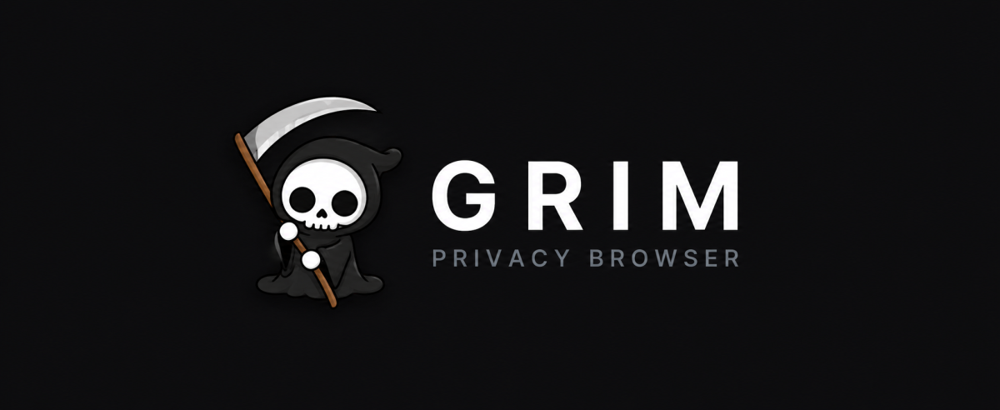

<div align="center">



### The privacy browser that thinks.

A private, black-and-white browser with a built-in AI, ruthless tracker blocking, and stealth tools — all in one.
**No tracking. No telemetry. No Google.**

**[⬇ Download for Windows](https://grimbrowser.netlify.app)** · Free & open source

</div>

---

## Features

- **🧠 Built-in AI** — Ask Grim anything, summarize any page, or search with an AI overview. Bring your own key: **DeepSeek** (free, via Hugging Face), **ChatGPT** (OpenAI), or **Gemini** (Google). Your key is stored encrypted on your device — usage is yours alone.
- **🛡 Shields** — Blocks ads & trackers with EasyList/EasyPrivacy, strips tracking params, unwraps AMP/redirects, removes identifying headers, and kills hyperlink auditing.
- **⌘ Command palette** — Hit `Ctrl+K` anywhere to jump between tabs, bookmarks, and actions, or fire a search instantly.
- **🕶 Stealth & cloak** — Disguise the tab title, hit the panic key, browse burner-style. Optional Tor routing.
- **🔎 Grim Search** — Private search with All / Images / Videos tabs and an AI overview up top — no logs.
- **🎨 Themes** — Light & dark, accent colors, animated backgrounds, falling petals — or Lite mode for pure speed.
- **📄 Ask Grim about this page** — One click and the AI reads + summarizes whatever you're viewing.
- **🛑 Download protection** — Files are scanned locally with Windows Defender before you open them.

## Install

### 🪟 Windows
Download the installer and run it — **everything's bundled (Tor included), no setup:**

**[⬇ Download for Windows](https://grimbrowser.netlify.app)**

> Windows may show a SmartScreen prompt (the app is unsigned) — click **More info → Run anyway**.

### 🍎 macOS  &  🐧 Linux (any distro)
One command — needs `git` and [Node.js](https://nodejs.org):

```bash
curl -fsSL https://grimbrowser.netlify.app/install.sh | bash
```

Then run it with `cd ~/GrimBrowser && npm start`. (Native `.dmg` / AppImage installers are on the way.)

### 📱 Android & iPhone
Not yet — Grim is a desktop app today. A mobile version is a separate build in the works.

## Setting up the AI

The AI needs a free key. Open **Settings → Information → Grim AI — Model Access**:

1. Pick a **provider** (DeepSeek is free).
2. Click **Get a key**, create one, and paste it in.
3. Choose a **model** and start chatting.

---

## For developers — build from source

```bash
git clone https://github.com/GrimTools/GrimBrowser.git
cd GrimBrowser
npm install
npm start          # run the app
npm run dist       # build the Windows installer (output in dist/)
```

**Requirements:** Node.js + npm. Built on Electron.

> **Tor:** `tor.exe` is bundled right in the repo (`tor/`), so Tor routing works out of the box — no extra downloads. Tor's cache regenerates itself on first run.

## Privacy

Grim collects **nothing** — no analytics, no crash reports, no usage pings. Settings, history, and AI chats never leave your device. Search runs through Grim Search (no logs), and the AI runs on *your* key. Grim hosts no content itself; it only loads the public pages you choose to visit.

## Tech

Electron · Chromium · [@ghostery/adblocker](https://github.com/ghostery/adblocker) (EasyList/EasyPrivacy) · Windows Defender (local scanning)

## License

MIT — do whatever you want, no warranty.
